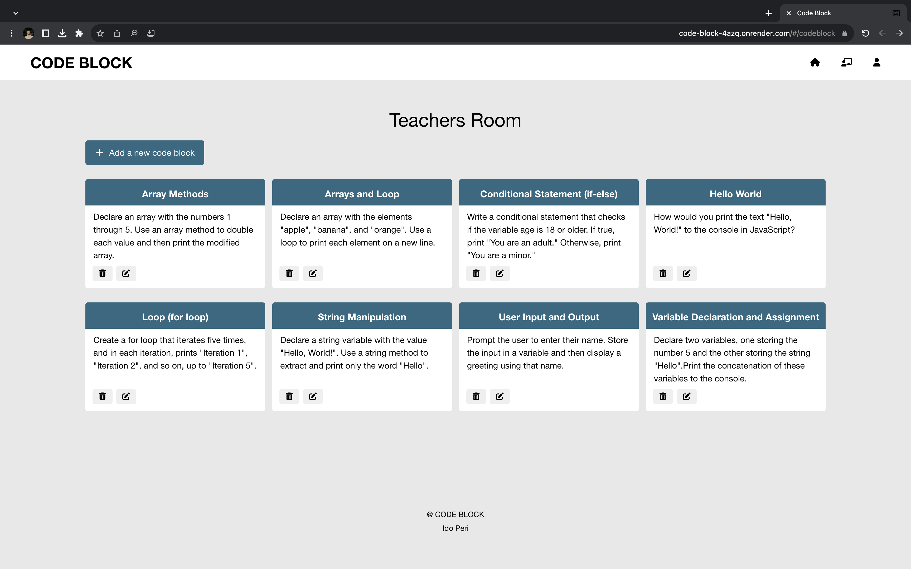

# Code Block

Welcome to Code Block, the ultimate online coding web application.

The application is responsive for all screen sizes. 

You can access the deployed application at https://code-block-4azq.onrender.com

## Navigation

- [Features](#features)
- [Technology Stack](#technology-stack)
- [Screenshots](#screenshots---admin-panel)
- [Mobile](#mobile)
- [Getting Started](#getting-started)

## Features
### Teacher Room
- Teacer registration and authentication.
- Full CRUD on code blocks.

### Online Coding Web App
- Navigation through different parts of the application.
- Code changing displaying in real-time (Socket).
- Student and teacher mode.

## Technology Stack

### Frontend
- React
- Redux
- React Router
- Axios
- Scss

### Backend
- Node.js
- Express
- MongoDB
- bcrypt
- socket.io

## Screenshots

### Lobby Page

The lobby page features a hero section and a list of code block for the student.

### Code Block Page

The code block page features code question, code changing in real time, solution for the question, save button and check button.

### Code Block Index

The code block index features full CRUD on code blocks, only for teachers.

### Login Page

The Login page allows the teacher to enter the code block index, and has a demo login button.

## Mobile

## Getting Started

To run the Code Block application locally, follow these steps:

1. Clone this repository to your local machine.
2. Navigate to the `code-block-backend` directory and run `npm install` to install the backend dependencies.
3. Start the backend server by running `npm run server:dev`.
4. Navigate to the `code-block-frontend` directory and run `npm install` to install the frontend dependencies.
5. Start the frontend server by running `npm start`.
6. Open your web browser and navigate to `http://localhost:3000` to access the Code Block application.
